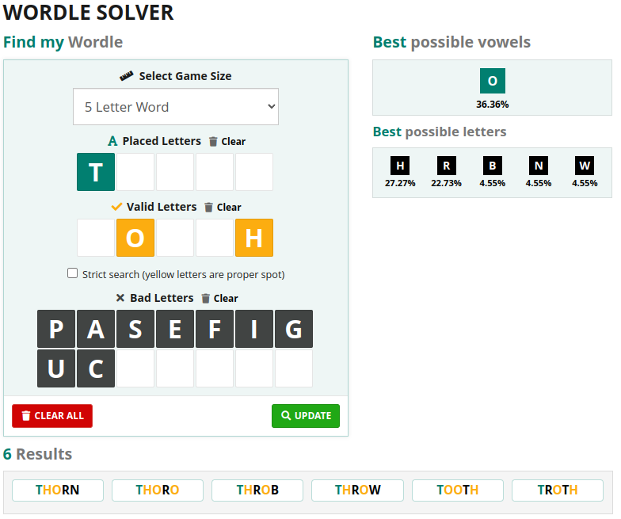

# would-you-wordle
Points: 250
Someone left this secret text string and unfinished Wordle. Can you put them together to get the flag?
pUpPHg3KfB15MG2KGtQQMDEECPOF8oa3VA==

## Solving

Okay lets have a look at it. The hint tells us something about "*Ron's code*". This should be RC4 according to this:

> RC4 (for 'Ron's Code 4') is a stream cipher developed by Ronald L. Rivest in 1987 that has been widely used with standards such as HTTPS, SSH 1, and WEP or WPA. Officially, RC4 is a trademark of RSA Security and is secret.

So I opened up the [CyberChef](https://gchq.github.io/CyberChef/) and chose the RC4 option. Then we put the BASE64 string into the input field. Okay next we need the "*key*". Let's have a look into the wordle. Solving this, should give us the key, right?

I cheated and used this [word finder](https://www.thewordfinder.com/wordle-solver/). Okay - after filling the form I got 6 possible answers 

I tried them in lower and upper case as key and with "*thorn*" I was able to decrypt that thing.

Don't forget to set the input to Base64
