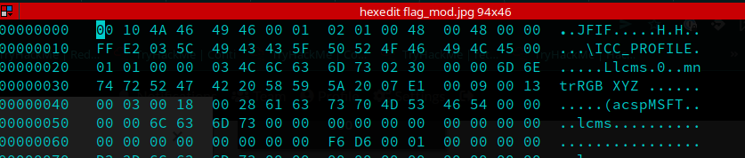

# corrupted-file
Points: 400
Can you find a way to fix our corrupted .jpg file?

## Solving

First we check the corrupted file with `file`:

```
$~: file flag_mod.jpg
flag_mod.jpg: data
```

Okay, then let's look with hexedit or something similar, to look for further hints.



Okay - I see the JFIF tag in there, but why could we open the image?
I checked the magic numbers for the jpeg files.

1. The beginning of the magic number is missing
1. adding `FF D8 FF E0`
1. Now we can open the Image :D
