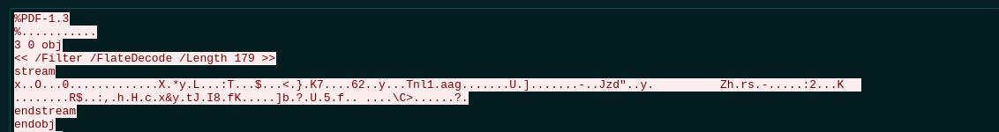

# stolen-data
Points: 150
Someone accessed the server and stole the flag. Use the network packet capture to find it.

## Solving

Okay - let's load the pcap file into wireshark and have a further look. 
1. First I tried to download all interessting files... html and so on, but this was a dead end. 
1. After that I looked in the statistics and the used connections (Ports and IP addresses. There we can see the port `4444`. This looks quite interessting. Let's follow the TCP stream.  As you can see in the screenshot, it looks like a pdf file. So let's safe the file as pdf file and try to open it.

And there is the flag.
